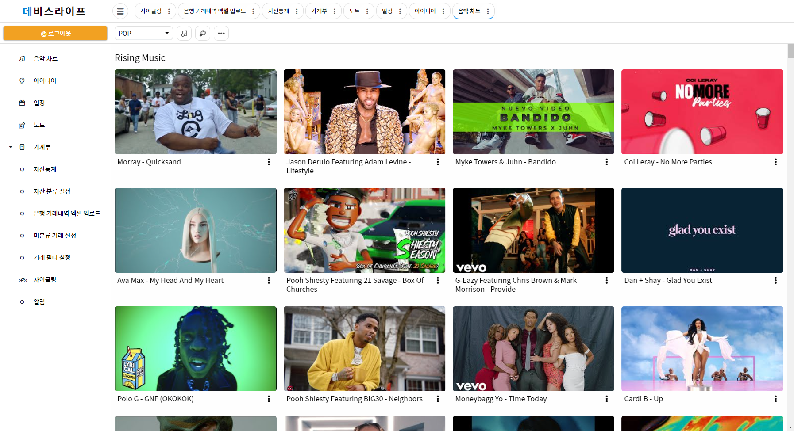
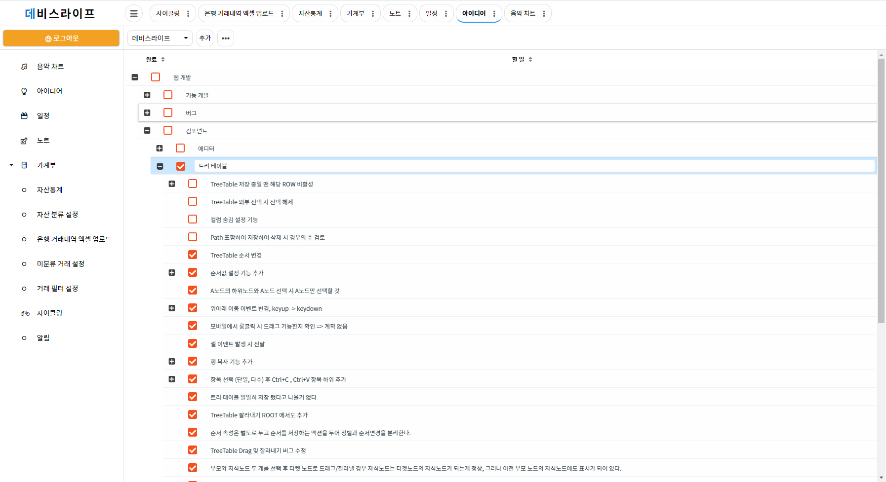
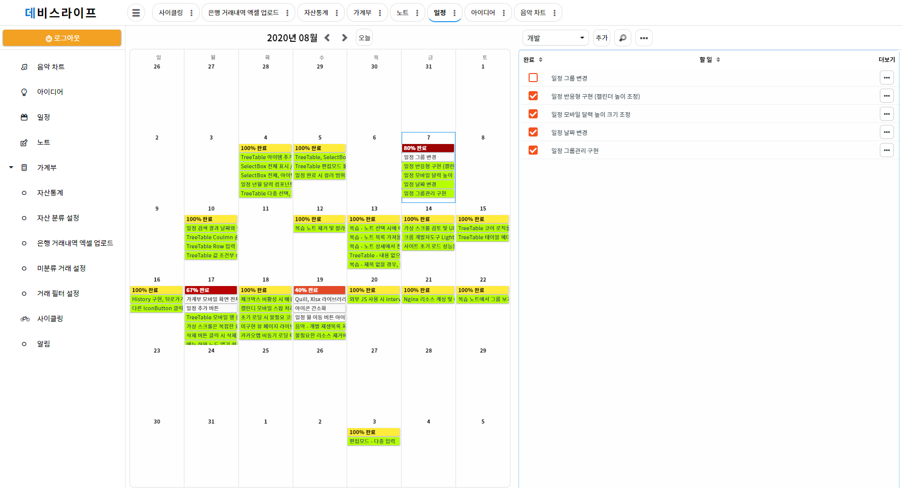
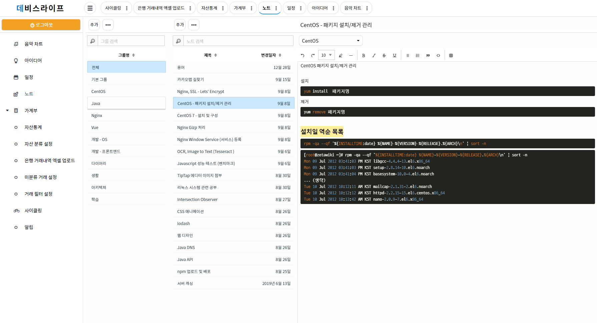
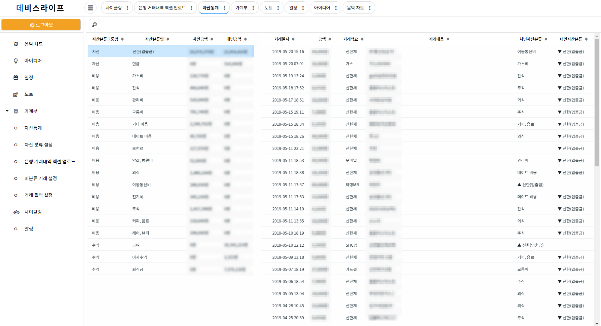
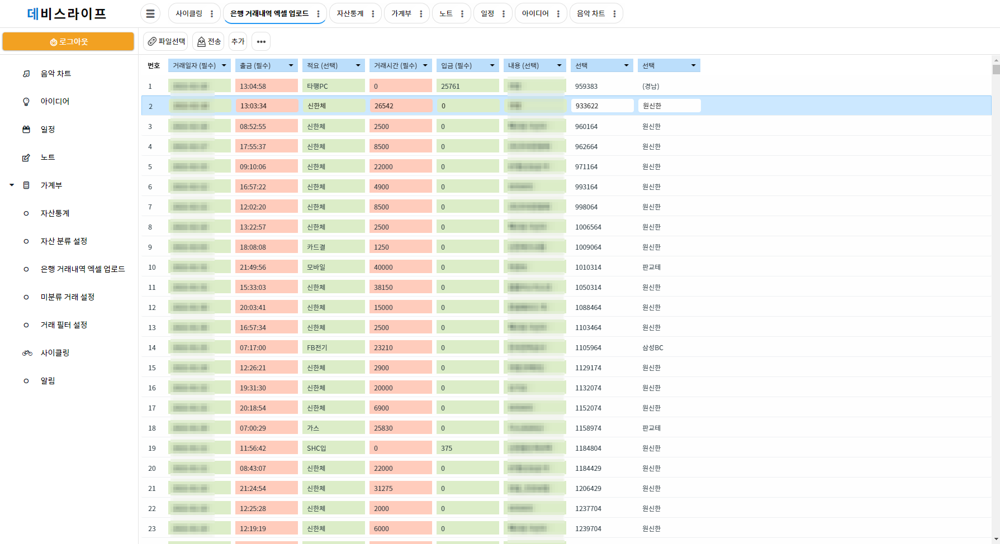
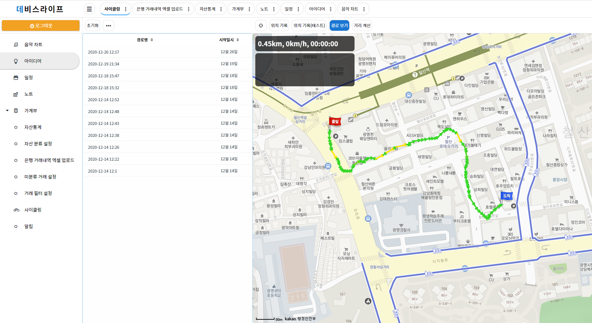

# 데비스라이프 포트폴리오
> 이 프로젝트는 개발 인생을 꿈꾸며 나 자신을 시작으로 사람들의 일상 전반을 지원하는 프로젝트입니다.
> 최종적인 목표는 사람들의 생활을 이롭게 하는 비서 솔루션이 목표입니다.

## 직무기술
### 인프라
- CentOS7
- Nginx
- Tomcat
- Gitlab
- Nexus OSS
- MySQL 7
- Swagger UI

### 개발
- Java 8
- Spring Boot 2
- JPA (QueryDSL)
- Mybatis
- Vue.js
- Maven
- Lombok

## 구현화면

